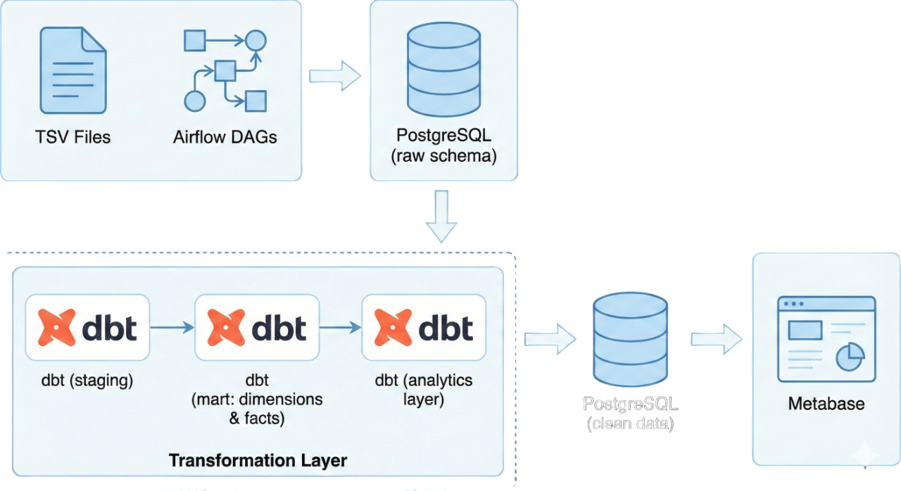

# Retail Pipeline — Airflow + DBT + PostgreSQL

This project is an end-to-end retail analytics pipeline built with:

- **Apache Airflow** – Workflow orchestration  
- **dbt (Data Build Tool)** – Data transformation  
- **PostgreSQL** – Local data warehouse  
- **Docker/Podman Compose** – Containerized environment  

It simulates a modern data engineering architecture from raw ingestion to analytics outputs.

---

## 🚀 Architecture Overview




---

## 📁 Project Structure

```
poc/
├── airflow/
│   ├── dags/                  
│   ├── logs/
│   └── plugins/
│
├── data/                      
│
├── dbt/
│   └── retail_project/
│       └── retail_project/
│           ├── models/
│           │   ├── staging/         
│           │   ├── marts/           
│           │   ├── analytics/       
│           │   └── sources.yml
│           └── dbt_project.yml
│
├── postgres/
│   └── data/                  
│
├── docker-compose.yml
└── Dockerfile
```

---

## 🐳 Running the Pipeline (Docker/Podman Compose)

### 1. Build the custom Airflow image (includes dbt)
```bash
podman build -t poc-airflow .
```

### 2. Start all services
```bash
podman-compose up -d
```

### 3. Web UIs
- **Airflow UI:** http://localhost:8082  
- **PostgreSQL:** accessible via port `55432`

---

## 🛠️ Airflow DAGs

### Ingestion DAGs
- `ingest_customers_raw.py`
- `ingest_products_raw.py`
- `ingest_sales_raw.py`
- `ingest_stores_raw.py`

### dbt Pipeline DAG
- `dbt_full_pipeline.py`  
  Executes:
  - `dbt deps`
  - `dbt run`
  - `dbt test`

---

## 🧱 DBT Models Overview

### **1. Staging Layer (`staging.`)**  
Cleans raw data, renames fields, casts data types.

### **2. Mart Layer (`mart.`)**  
Star-schema style dimensional modeling:
- `dim_customer`
- `dim_product`
- `dim_store`
- `fact_sales`

### **3. Analytics Layer (`analytics.`)**  
Higher-level analytical models:
- `customer_features` – tenure, total tx, total spent
- `daily_sales_kpi` – daily sales KPI summary
- `daily_store_sales` – store-level daily metrics

---

## 🔧 PostgreSQL Connection Info

Use the following settings (example for DBeaver):

```
Host: localhost
Port: 55432
User: airflow
Password: airflow_pass
Database: retail_dwh
```

Schemas used:
- `raw`
- `staging`
- `mart`
- `analytics`

---

## 🗂️ .gitignore

Generated or large directories intentionally excluded:
- `airflow/logs/`
- `postgres/data/`
- `dbt/**/target/`
- `dbt/**/dbt_packages/`
- `__pycache__/`

---
